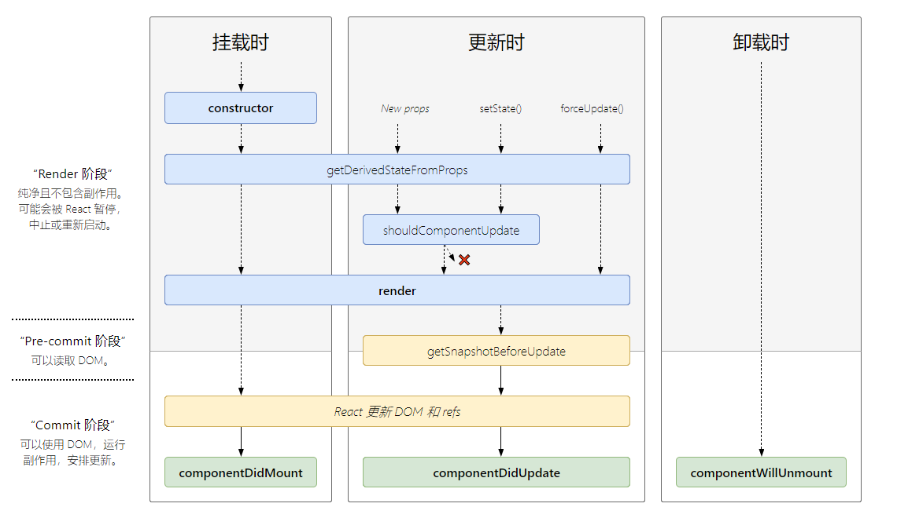

### react
#### react定义组件的三种方式
1.函数式无状态组件
<pre><code>function CustomComponent(props){
    return 	&lt;div&gt; Hello {props.name}	&lt;/div&gt;
}
</code></pre>
2.es5方式React.createClass组件
<pre><code>var CustomComponent = React.createClass({
    propTypes: {//定义传入props中的属性各种类型        
        initialValue: React.PropTypes.string
    },
    defaultProps: { //组件默认的props对象       
         initialValue: " "
     },
    // 设置 initial state    
    getInitialState: function(){//组件相关的状态对象        
        return {
            text: this.props.initialValue || ''      
         };
    },
    handleChange: function(event){
        this.setState({ //this represents react component instance       
             text: event.target.value
        });
    },
    render: function() (
           &lt;div&gt;
                Type something:
                &lt;input onChange={this.handleChange} value={this.state.text} /&gt;
            &lt;/div&gt;
        );
    }
});
CustomComponent.propTypes = {
    initialValue: React.PropTypes.string
};
CustomComponent.defaultProps = {
    initialValue: ''
};
</code></pre>

3.es6方式extends React.Component
<pre><code>class CustomComponent extends React.Component{
    constructor(props) {
        super(props);
        // 设置 initial state       
        this.state = {
            text: props.initialValue || ''        
        };
        // ES6 类中函数必须手动绑定        
        this.handleChange = this.handleChange.bind(this);
    }
    handleChange(event) {
        this.setState({
            text: event.target.value
        });
    }
    render() {
        return (
           &lt;div&gt;
                Type something:
                &lt;input onChange={this.handleChange} value={this.state.text} /&gt;
            &lt;/div&gt;
        );
    }
}
CustomComponent.propTypes = {
    initialValue: React.PropTypes.string
};
CustomComponent.defaultProps = {
    initialValue: " "
};
</code></pre>

### state、prop 状态提升
state指的是能够影响视图更新的状态，如果一个状态和试图的更新无关，不应该放在state中，可以放在state外面。

组件自身维护的状态为state，由父组件传递过来的状态为prop，组件修改自身状态使用setState，组件不应该直接修改prop，而应该让父组件去修改prop，组件不维护prop的更新。

当兄弟组件需要共享一个状态时，应该将状态提升到共同的父组件，然后通过prop传递给子组件，当一个子组件通过通知父组件修改状态后，另一个组件可以接收到更新，并同步视图更新。

### setState
组件修改自身状态时，使用setState，state的值不能直接修改的，一个是react限制了对state的修改，另外一个是state是与视图相关的，当state变化后，视图需要变化，直接修改state，react不会收到通知需要修改视图。

setState在修改了state后，会异步去更新视图。setState对state的修改也不是同步的，如果你多次修改state，react会合并对state的修改，如果你的state更新依赖上一次更新后的结果，那么需要注意你拿到的state可能是还没有更新的state，对于这种情况，setState可以接收一个函数，函数的参数是更新后的state和prop。

react执行完合并后的state更新后，会按顺序执行以下钩子函数
+ static getDerivedStateFromProps()
+ shouldComponentUpdate()
+ render()
+ getSnapshotBeforeUpdate()
+ componentDidUpdate()

其中，可以在shouldComponentUpdate中阻止视图的更新，这个通常是一个可以用来性能优化的地方。阻止不必要的diff过程。

因为state的值的更新不是在调用setState后立即更新的，所以在读取state的值时可能遇到读取的值是为更新的state，为了获取更新后的值，可以在componentDidUpdate中读取，setState也支持另外一个可选参数，这个参数是state更新后的回调函数，也可以保证拿到更新后的state。

### 组件的生命周期
先放一张官方给的组件生命周期流程图

组件一般会有三个不同的阶段，第一个是组件的创建阶段，在这个阶段，组件分别执行以下钩子函数：
+ constructor() 初始化state和绑定事件的this
+ static getDerivedStateFromProps()
+ render()
+ componentDidMount()   组件挂载后调用，此时可执行依赖DOM节点的操作，请求数据等

组件的更新
+ static getDerivedStateFromProps()
+ shouldComponentUpdate()   props 或 state 发生变化后，渲染执行之前调用
+ render()
+ getSnapshotBeforeUpdate() DOM更新前调用
+ componentDidUpdate()  组件更新后调用

组件的销毁
+ componentWillUnmount()    组件卸载及销毁之前调用

### react实现双向绑定
react的双向绑定需要自己实现，并不能像angular和vue那样通过一条指令实现。首先是要把input的value绑定到组件的state一个属性上，然后是监听change事件，将新输入的值调用setState更新到state中。

### react的性能优化
shouldComponentUpdate钩子函数可以控制组件的更新，默认总是返回true，一般不需要使用这个钩子函数，但出现可感知的性能问题时，可以覆盖该钩子函数，当prop和state变化后，如果确定不需要更新组件，可以返回false，来跳过后面的生命周期函数执行，从而达到提升性能的效果。

使用React.PureComponent组件来进行浅比较，可以在一些场景下，可以代替shouldComponentUpdate，React.PureComponent使用浅比较来判断是否需要更新组件，当数据结构很复杂时，可能不适用。

### react的diff算法
diff算法是最小编辑距离问题的应用，对于树的最小编辑距离，复杂度很高，react在处理diff时，并没有期望得出最小的编辑距离，而是作了以下假设，来把复杂度降低到线性。
+ 两个不同类型的元素会产生出不同的树；
+ 开发者可以通过 key prop 来暗示哪些子元素在不同的渲染下能保持稳定；

对于新旧两个组件树，react是从根开始比较，如果二者是不同类型，那么按照上面的第一个假设，那么他们下面的子树也会完全不同，react会用新树完全替换掉旧树。如果类型相同，则会递归往下依次比较，得出新旧两颗树的差异。

在比较列表时，react会按照对应顺序依次对比，当往列表头部插入时，因为错位导致比较结果的差异会比较大，通过加入key的方式，react的diff算法使用key来进行比较，并且采用了不同的算法，能够识别出往列表中插入这种情况，得出最小的差异。

### react的合成事件
react的事件处理程序中会传入SyntheticEvent，这个是对原生事件对象的包装，他与原生事件对象有相同的接口，有 stopPropagation() 和 preventDefault() 方法。SyntheticEvent会在不同事件中复用，如果需要在其他地方使用SyntheticEvent的属性，可以使用event.persist()来避免复用该对象。