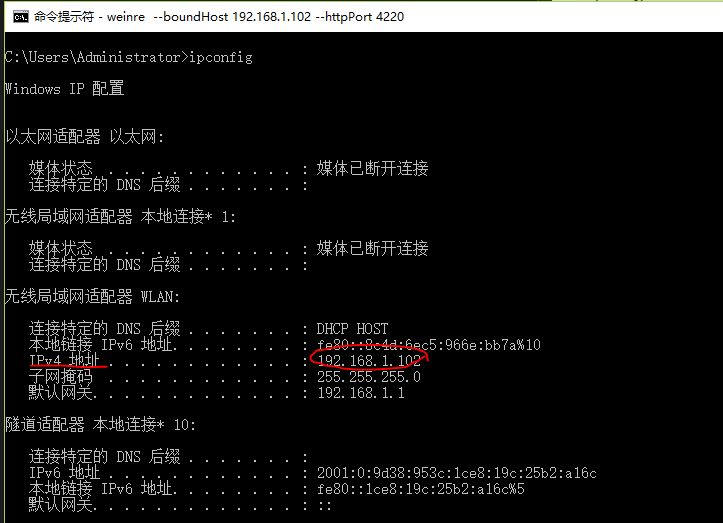
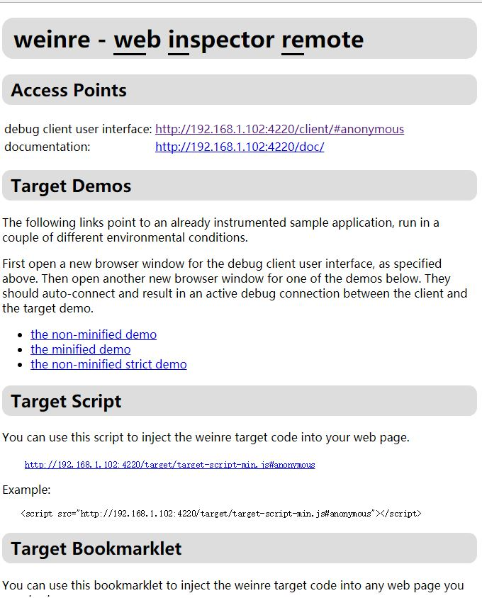
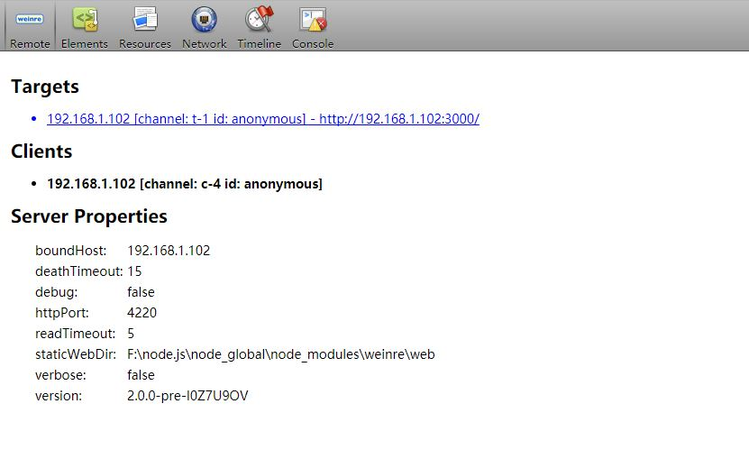

# Weinre调试移动端Web
### 安装Weinre
<pre><code>npm install -g weinre</code></pre>

### 获取本地IP地址
<pre><code>ipconfig</code></pre>

### 在本地开启一个监听服务器
<pre><code>weinre --boundHost 10.240.154.164 --httpPort 4220</code></pre>
+ httpPort 调试服务器运行的端口，默认的 8080，如果这个端口有在用，可以改为其它端口；
+ boundHost 调试服务器绑定的 IP 地址（或域名），默认 localhost，如果设置为 -all-，表示绑定到所有当前机器可以访问的接口。

### 访问http://10.240.154.164:4220,出现以下页面，说明安装成功

### 找到Target Script
将里面提到的脚本添加到需要调试的HTML中，可以直接拷贝提供的Example，如我这边需要添加的是
<pre><code>&lt;script src="http://192.168.1.102:4220/target/target-script-min.js#anonymous"&gt;&lt;/script&gt;</code></pre>

### 打开debug client
页面最上方有一个**Access Points**，打开里面的`debug client user interface`对应的地址，可以看到如下这样一个页面

其中`Targets`列出了可调试的页面列表，默认蓝色，表示未开启调试，如果为空表示还没有可调试的页面，这个时候要去检查要调试的页面是否已经打开，如果已经在浏览器中打开，就要检查是否要要求添加了前面提到的脚本。

### 如果一切正常，就可以开始调试了
`debug client`页面最上面的按钮是提供的可调试内容，可依次选择进行相关操作。